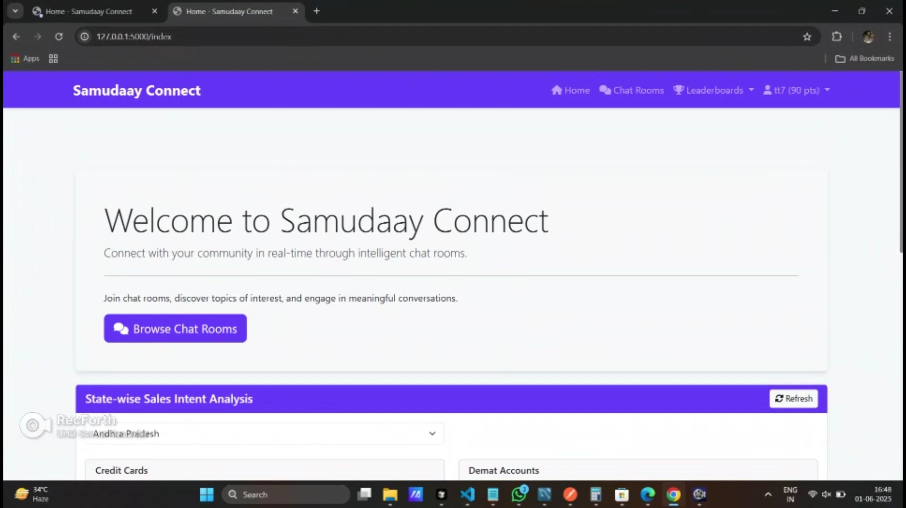
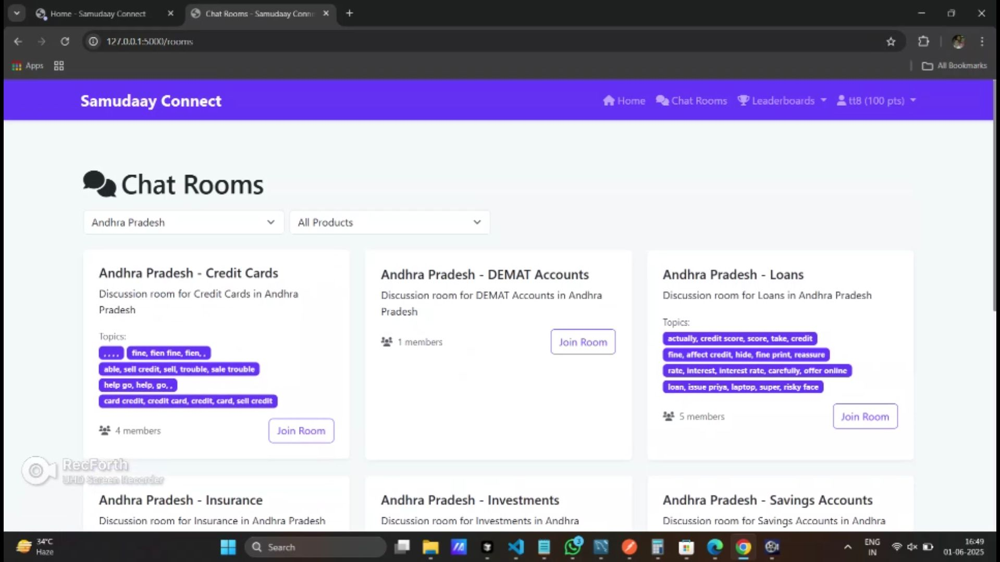
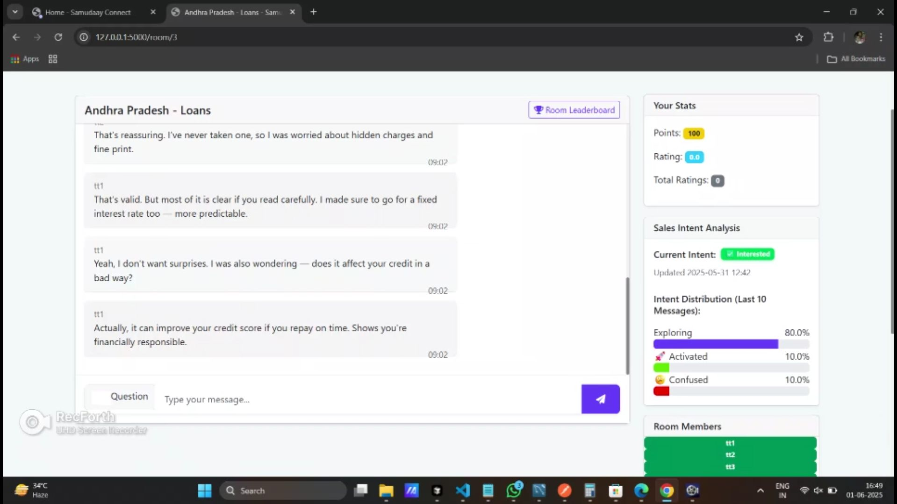
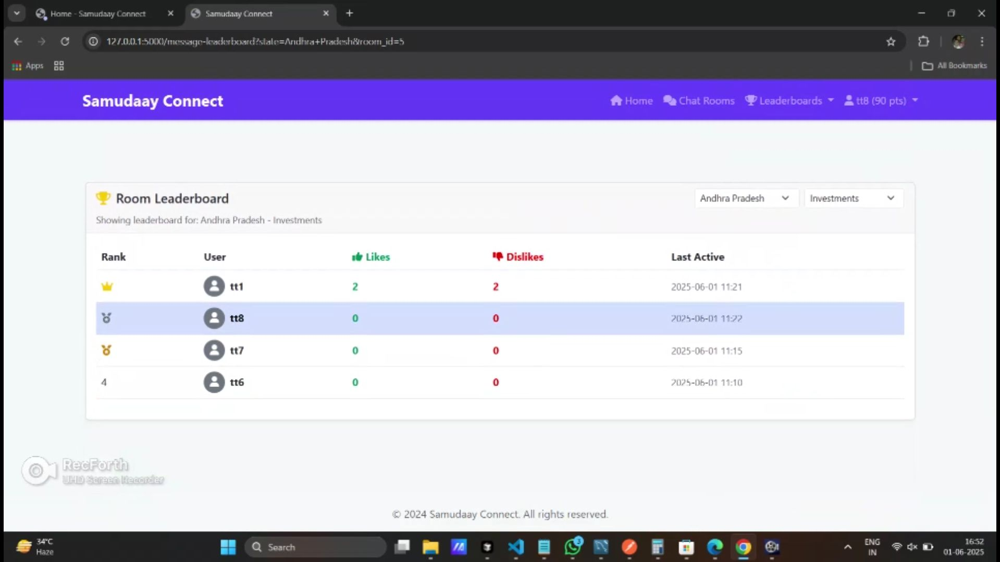

# groMO Samudaay Connect

This project is part of the **groMO Samudaay** initiative to intelligently connect grassroots partners (GPs) through features such as onboarding, chat analysis, intelligent search, summarization, and personalization using ML and LLMs.







## Features

- User registration & authentication
- Real-time chat with Socket.IO
- Topic modeling & summarization
- Intelligent room suggestions
- Admin dashboard
- Personalized content via ML

## Technologies Used

- Python, Flask
- HTML, CSS, JavaScript
- SQLAlchemy, SQLite/MySQL
- Flask-SocketIO
- Machine Learning (sklearn, transformers)
- Git, GitHub

## Getting Started

```bash
git clone https://github.com/trilokdhakad/groMO-samudaay-connect.git
cd groMO-samudaay-connect
# make a virtual environment first
pip install -r requirements.txt
python run.py
